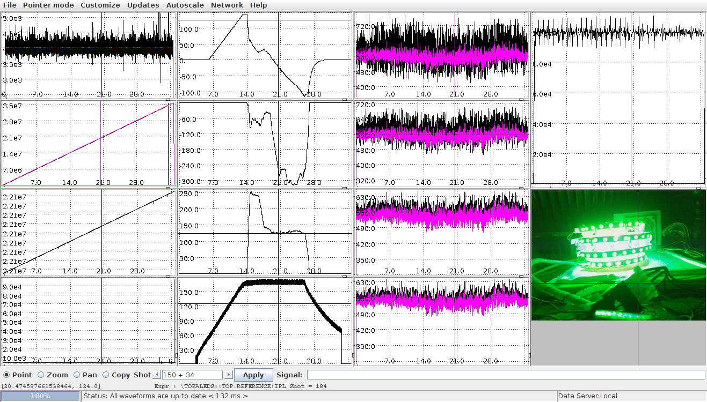

**The Tokaled**

During the first pandemic lockdown, starting from The Tokamak Model of Stevie Wray (https://www.thingiverse.com/thing:3264356), is
born the **Tokaled**.
The Tokaled coils (leds) are controlled by an Arduino nano talking via SPI with a raspeberry pi that runs the MARTe2 framework.
The Raspberry feeds the pwm values for TF, CS, PF and Plasma Current leds, using data coming from the **GLORIOUS FTU Tokamak** experimental dataBase (mdsplus trees).

**_Construction Phase:** https://www.thingiverse.com/make:964760:_

<table halign="center">
<tr>
<td>

</td>
<td>
 
</td>
</tr>
</table>

For the plasma I ve used a transparent pipe rolled up like a helicoid and filled
with an rgb strip.  I connect for IPL the blue light while the PF leds are green, CS are RED, TF are white.

To assemble it, I had to collapse all the TF coils togheter, than I put the plasma pipes inside and I roll it (in an helicoidal way), than I expand again the TF Coils and I put all on the base.

**_Operatin Phase:** https://www.thingiverse.com/make:964745:_

Thera are several Configuration Files with different MARTe2 components to realize differnt Features.
 

The lights are proportional to the modules of the currents flowing in an FTU experiment.

**A Brief List of HW/SW**

Hardware:
- Rpi2 or better
- picam (not mandatory)
- Arduino Nano
- h-bridge l293d
- 12V or 5V DC RGB led strips (with resistances)
- 5V or 12 V DC power supply

Software:

- https://vcis-gitlab.f4e.europa.eu/aneto/MARTe2 branch develop_armv8_linux
- https://vcis-gitlab.f4e.europa.eu/aneto/MARTe2-components
- https://mdsplus.org
- in this repo you can find arduino firmware, MARTe cfg , jscope file, mdsplus data tree , connection schematic and board, etc...https://github.com/LucBonc/tokaled

